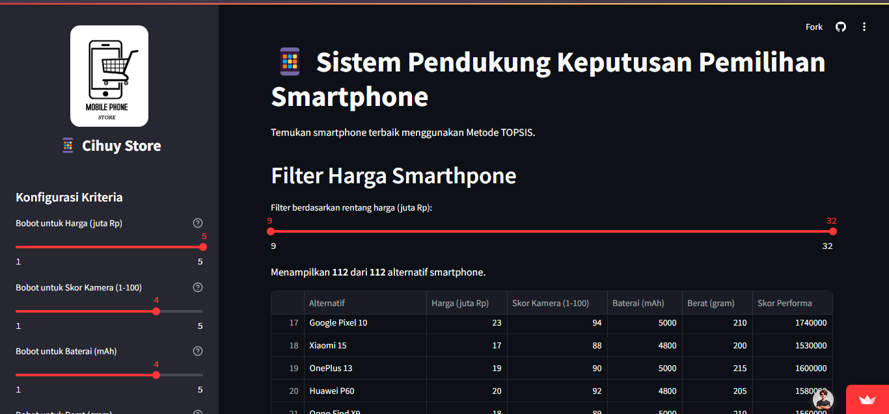

# 📱 Sistem Pendukung Keputusan Pemilihan Smartphone dengan TOPSIS

[](http://topsis-smartphone-app-sic.streamlit.app/)

Selamat datang di proyek Sistem Rekomendasi Smartphone! Aplikasi web interaktif ini dibangun untuk membantu pengguna dalam memilih smartphone terbaik berdasarkan preferensi pribadi mereka menggunakan **Metode TOPSIS (_Technique for Order of Preference by Similarity to Ideal Solution_)**.

Proyek ini merupakan implementasi dari studi kasus mata kuliah Sistem Informasi Cerdas, yang mengubah teori pengambilan keputusan multi-kriteria menjadi sebuah aplikasi yang fungsional dan mudah digunakan.



> _Tampilan antarmuka aplikasi yang telah di-deploy._

## ✨ Fitur Utama

- **Perhitungan TOPSIS Dinamis:** Menghasilkan peringkat smartphone berdasarkan data dan bobot yang diberikan.
- **Konfigurasi Bobot Interaktif:** Pengguna dapat menyesuaikan tingkat kepentingan (bobot) untuk setiap kriteria melalui _slider_ di _sidebar_.
- **Filter Harga Real-time:** Memungkinkan pengguna untuk menyaring daftar smartphone berdasarkan rentang harga yang diinginkan.
- **Visualisasi Hasil yang Menarik:**
  - 🏆 Peringkat untuk 3 smartphone teratas.
  - 📊 Bar chart horizontal untuk 10 peringkat teratas.
  - 🕸️ Grafik Radar untuk menganalisis profil keunggulan smartphone juara.
- **Transparansi Perhitungan:** Menyediakan detail langkah-langkah matematis (matriks ternormalisasi & terbobot).

## 🛠️ Teknologi yang Digunakan

- **Bahasa Pemrograman:** `Python`
- **Framework Aplikasi Web:** `Streamlit`
- **Manipulasi Data:** `Pandas` & `NumPy`
- **Visualisasi Data:** `Plotly`

## 📂 Struktur Proyek

Struktur file dan folder dalam proyek ini diatur sebagai berikut untuk keterbacaan dan pemeliharaan yang mudah:

```
topsis-smartphone-app/
├── 🖼️ assets/             # Folder untuk menyimpan gambar (logo, medali, dll.)
│   ├── apps.png
│   ├── phone_logo.jpg
│   ├── phone1.jpg
│   ├── phone2.jpg
│   └── phone3.jpg
├── 📜 app.py             # File utama aplikasi Streamlit
├──  csv data_smartphone.csv  # Dataset alternatif smartphone
├── 📄 README.md          # Dokumentasi proyek
├── 📝 requirements.txt    # Daftar library Python yang dibutuhkan
└── 🧠 topsis.py          # Modul yang berisi logika inti algoritma TOPSIS
```

## 🚀 Cara Menjalankan Proyek Secara Lokal

Ingin mencoba atau mengembangkan aplikasi ini di komputer Anda sendiri? Ikuti langkah-langkah berikut:

### **Prasyarat**

- Pastikan Anda telah menginstall [Python](https://www.python.org/downloads/) (versi 3.8 atau lebih baru).
- Pastikan Anda telah menginstall [Git](https://git-scm.com/downloads/).

### **Langkah-langkah Instalasi**

1.  **Clone Repositori**
    Buka terminal atau Git Bash Anda dan jalankan perintah berikut:

    ```bash
    (https://github.com/novrianpratama/topsis-smartphone-app.git)
    ```

2.  **Masuk ke Direktori Proyek**

    ```bash
    cd topsis-smartphone-app
    ```

3.  **Install Dependensi**
    Install semua library yang dibutuhkan dari file `requirements.txt`.

    ```bash
    pip install -r requirements.txt
    ```

4.  **Jalankan Aplikasi Streamlit**
    Setelah instalasi selesai, jalankan aplikasi dengan perintah:

    ```bash
    streamlit run app.py
    ```

## 📖 Metodologi TOPSIS

Metode TOPSIS bekerja dengan prinsip sederhana namun kuat: **alternatif terbaik adalah yang memiliki jarak terpendek dari solusi ideal positif dan jarak terjauh dari solusi ideal negatif.**

- **Solusi Ideal Positif (A+)**: Sebuah solusi hipotetis yang terdiri dari semua nilai terbaik yang bisa dicapai untuk setiap kriteria (misalnya, harga termurah, performa tertinggi, baterai terbesar).
- **Solusi Ideal Negatif (A-)**: Kebalikannya, solusi ini terdiri dari semua nilai terburuk untuk setiap kriteria (harga termahal, performa terendah, dll.).
